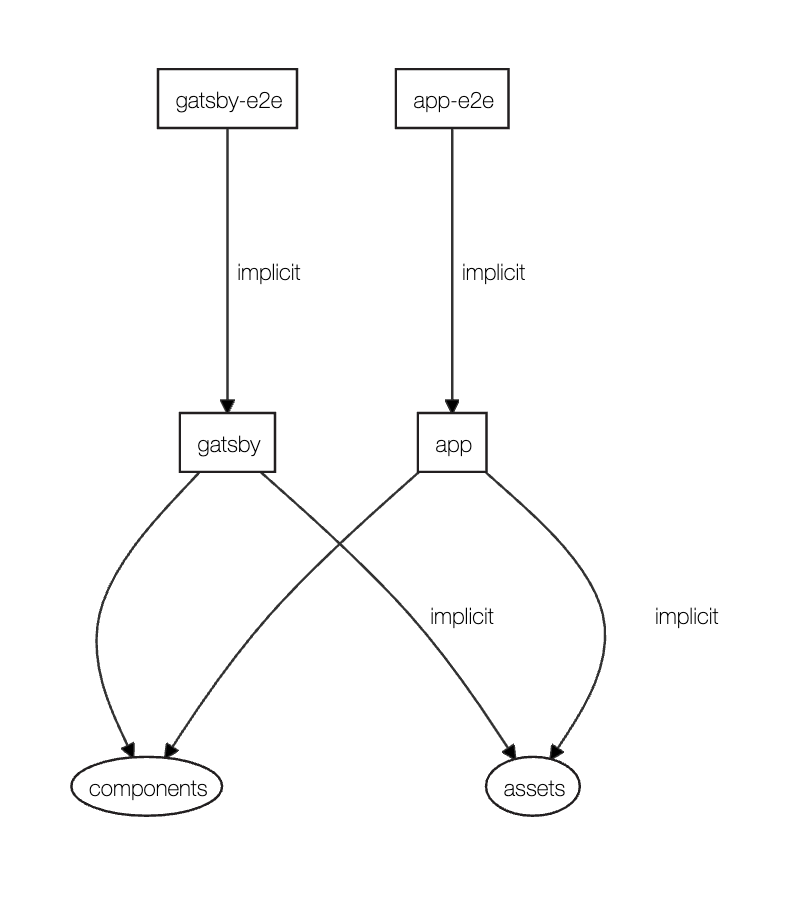

# NxGatsby

## Goal

- check how the Gatsby works with Nx

## Documentation

- [Nx](docs/nx.md)

- [Project creation commands (steps)](docs/project-creation-commands.md)

## Project dependency graph

## Findings

- at the first try it's possible to add the Gatsby site inside of the nx workspace, the only point until now was to add the support to the project it was needed to run the following command:

`npm i --save-dev @nrwl/gatsby gatsby-cli`

- to run the gatsby generate site inside of the nx workspace you should use the command:

`nx serve generated-site-name` (on this example it was `gatsby`)

- using the Gatsby inside of the Nx workspace it's basically like have 2 react applications, nothing special was notice to be able to use it

## Links

- [React](https://reactjs.org/)

  - [React Router](https://reactrouter.com/)

- [Gatsby](https://www.gatsbyjs.org/)

  - [Gatsby Docs](https://www.gatsbyjs.org/docs/)

  - [gatsby-plugin-typescript](https://www.gatsbyjs.org/packages/gatsby-plugin-typescript/) - [caveats](https://www.gatsbyjs.org/packages/gatsby-plugin-typescript/?=#caveats)

  - [gatsby-plugin-root-import](https://www.gatsbyjs.org/packages/gatsby-plugin-root-import/)

- [Nx: Extensible Dev Tools for Monorepos (React)](https://nx.dev/react)

  - [Plugins | Nx Docs](https://nx.dev/react/plugins/overview)

  - [[YouTube] Nx: Extensible Dev Tools for Monorepos (React)](https://www.youtube.com/watch?v=E188J7E_MDU)

  - [Gatsby support, custom workspace layouts, and more in Nx 9.4! | Nrwl](https://blog.nrwl.io/gatsby-support-custom-workspace-layouts-and-more-in-nx-9-4-497ae105bf4)

    - [Gatsby Plugin for Nx | NPM package](https://www.npmjs.com/package/@nrwl/gatsby)

    - [[GitHub] nrwl/gatsby](https://github.com/nrwl/gatsby) - Nx plugin for Gatsby

  - [Storybook](https://storybook.js.org/) - [Nx support](https://nx.dev/react/guides/modernize-storybook-react)

    - [Storybook support, run-many command, UI improvements, and more in Nx 8.8 | Nrwl](https://blog.nrwl.io/storybook-support-run-many-command-ui-improvements-and-more-in-nx-8-8-90575cb5dda4)

    - [Nx 8.8: Now You Can Write UI Tests with Storybook and Cypress | Nrwl](https://blog.nrwl.io/ui-testing-with-storybook-and-nx-4b86975224c)

  - [Powering Up React Development With Nx | Nrwl](https://blog.nrwl.io/powering-up-react-development-with-nx-cf0a9385dbec)

  - [React Microfrontends and Monorepos: A Perfect Match | Nrwl](https://blog.nrwl.io/monorepos-and-react-microfrontends-a-perfect-match-d49dca64489a) - [demo](https://nrwl-nx-examples-cart.netlify.com/cart) | [code](https://github.com/nrwl/nx-examples)

## Development tip

- to make my life easier I have the current `node_modules` from the project mapped to the PATH env variable, that enables me to run the command `nx` directly, if you don't have if you must use the short cut mapped on the `package.json`, using it like `npm run nx ...`

  - `./node_modules/.bin`

### Known Gatsby TypeScript support limitation

- [gatsby-plugin-typescript caveats](https://www.gatsbyjs.org/packages/gatsby-plugin-typescript/?=#caveats)

  > Does not support baseUrl. Workaround: use [gatsby-plugin-root-import](https://www.gatsbyjs.org/packages/gatsby-plugin-root-import/) and configure it to point the baseUrl value (also set baseUrl option in tsconfig.json file).

### Known issues on MacOS

- [How to fix the Node gyp Error: No Xcode or CLT version detected | Reactgo](https://reactgo.com/gyp-xcode-or-clt-version-detected/)
